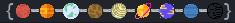
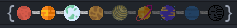
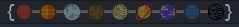
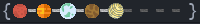
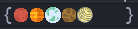
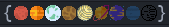
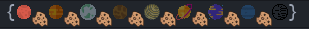
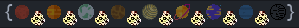

A minor-mode for GNU Emacs that allows a representative version of the position in the buffer through a highly customizable Solar System visual.

This is my first attempt at a minor mode.

# Installation

To use `planetary-mode`, drop this file and its `images/` folder into a folder belonging to your Emacs load-path, then

```(require 'planetary)```

Before invoking the mode, you'll probably want to set the variables seen below.

## Customization Options

At the moment, I still cannot find a way to have it restart upon variable declaration, so you must set the following BEFORE

`(planetary-mode 1)`

* `min-buffer-width` (defaults to `64`) - The minimum width of the window buffer it is attempting to access 

* `min-buffer-text` (defaults to `" Planetary"`) - If the buffer window's width is less than the min-buffer-width variable, without the variable, defaulted at `"*invalid*"`, replace with a text of your choice. (Hint! Use `(propertize)`!)

* `image-root` (defaults to the directory `planetary.el` is in) - You may set this if youre using the images for other things and wish the share the same directory without duplicating it, please enter the full directory. (e.g. `/home/name/.emacs.d/images/`).
* P.S.: It is set to get the extension from whatever directory this is set to when collecting the numerically named images, if images don't appear, its likely because either Emacs doesnt support it, or you don't.

* `debug-mode` (defaults to `nil`) - Rapidly print the data involved in grabbing images and various tasks.

* `exclude-similar-data` (default to `nil`) - If set to `t`, when printing the mode to the mode-line, it will also remove the `X%` and `L#` indicators beside it.

* `dark-planets` (defaults to `t`) - Rather than `empty.xpm`, display beside the already filled in ones which ones have not been filled in, tinted dark, of which these images are also self-selectable in `dark-standards/`

* `allowed-axis` (defaults to `t`) - If set to `nil`, the mode-line will no longer display axis.xpm between the images

* `dir-for-darks' (defaults to `"dark-standards/"') - Set to replace the name `dark-standards/' for whatever purpose you may be interested in

* `dir-for-normals' (defaults to `"normal-standards/"') - Set to replace the name `normal-standards/' for whatever purpose you may be interested in

The configuration, add as many images as you please, but follow the naming conventions:

```
|-- images (You can alter this with the "image-root" variable, be sure to list the full directory)
|   |-- dark-standards -- You can change the name of dark-standards with the dir-for-darks variable
|   |   |-- 0.xpm -- Our approach searches for which to add in the order of their numerical name representation
|   |   |-- 1.xpm -- Add whatever image types you'd like.
|   |   |-- 2.xpm
|   |   |-- 3.xpm
|   |   |-- 4.xpm
|   |   |-- 5.xpm
|   |   |-- 6.xpm
|   |   |-- 7.xpm
|   |   |-- 8.xpm
|   |   |-- axis.xpm -- The separator! If you wish to just have the numerical images you may set axis-allowed to nil
|   |   `-- contrast-flash.xpm
|   |-- empty.xpm
|   `-- normal-standards -- You can change the name of normal-standards with the dir-for-normals variable
|       |-- 0.xpm
|       |-- 1.xpm
|       |-- 2.xpm
|       |-- 3.xpm
|       |-- 4.xpm
|       |-- 5.xpm
|       |-- 6.xpm
|       |-- 7.xpm
|       |-- 8.xpm
|       |-- axis.xpm
|       `-- normal-flash.xpm
```

## Animation

In order to access the animation feature, you can either run

```M-x  start-blink``` for temporary usage

```M-x  start-blink-timer``` to start its blink every x time units, defined with `stand-up-timer` (defaults to `"30 min"`), can be enabled on startup of Planetary with `animated-timer` (defaults to `nil`).

```M-x stop-blink```. A must function. If it is blinking, you use this to restart the timer if `animated-timer` is enabled, or under any other circumstance, disabling `M-x start-blink`.

You can also click the planets to move to the lowest part of a given position, being the first part of the 9th that the buffer is divided into by default with the planets if you choose not to modify them yourself.

## Screenshots

At the bottom of the buffer:



In the middle of the buffer:



At the top of the buffer:



If `dark-planets` is set to `nil`:



If `axis-allowed` and `dark-planets` are set to `nil`:



If `allowed-axis` is set to `nil`:



The first part of the repetitive flash activated as seen above:



The second part of the repetitive flash activated as seen above:


